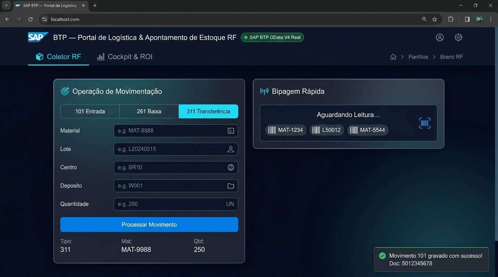
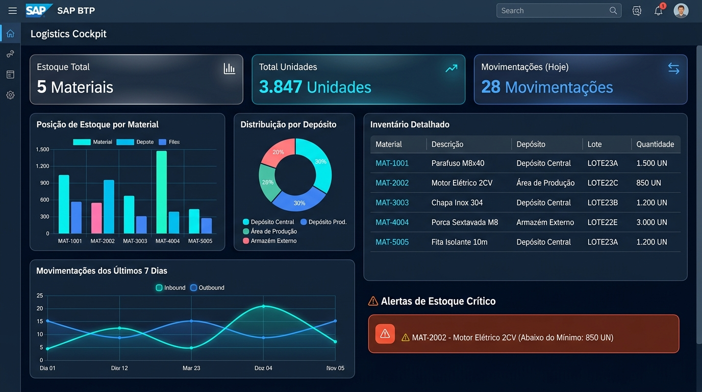
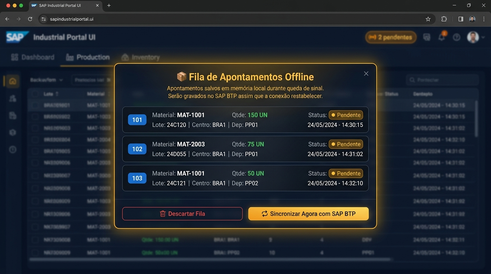
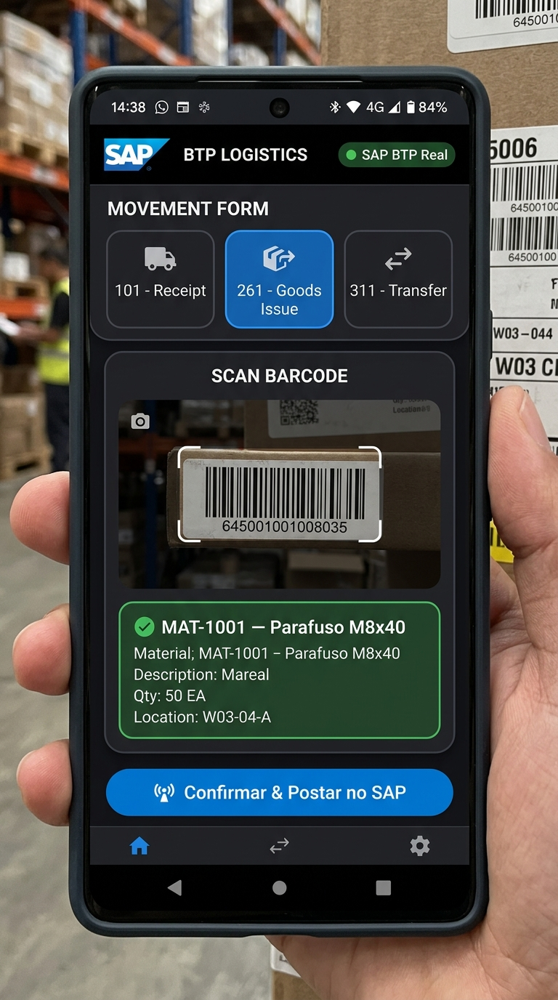

# 🏭 SAP BTP — Portal de Logística & Apontamento de Estoque RF

<div align="center">


**Solução de chão de fábrica que elimina licenças caras de usuário SAP.**  
Operadores apontam movimentações via tablet/coletor RF/celular, integrado ao SAP BTP ABAP Cloud via OData V4 em tempo real.

</div>

---

## 📸 Screenshots

### 🎯 Coletor RF — Apontamento de Movimentação


> Interface de chão de fábrica otimizada para operadores com leitores de código de barras Zebra e Honeywell. Bip industrial, flash visual e feedback háptico em cada bipagem.

---

### 📊 Cockpit Gerencial — Gráficos & Alertas de Estoque Crítico


> Dashboard com Chart.js: gráfico de barras por material, donut por depósito, linha de movimentações nos últimos 7 dias. Alertas automáticos de estoque abaixo do mínimo.

---

### 📦 Fila Offline — Resiliência em Áreas Sem Sinal


> Apontamentos são salvos localmente quando o Wi-Fi cai no galpão. Sincronização automática com o SAP BTP assim que a conexão é restabelecida — o operador nunca fica travado.

---

### 📱 PWA — Instalável no Celular e Coletor Zebra


> Funciona como app nativo em Android e iOS. Camera de scanner integrada via browser para leitura de códigos GS1-128 e DataMatrix com preenchimento automático de Material, Lote, Quantidade e Ordem de Produção.

---

## 🎯 O Problema que Resolvemos

Empresas que utilizam SAP ERP (ECC ou S/4HANA) enfrentam custo elevado para dar acesso a **operadores de galpão, almoxarifes e apontadores de chão de fábrica**.

| Modelo | Custo Anual (50 operadores) |
|---|---|
| **SAP Licenças Individuais Tradicionais** | ~US$ 90.000/ano |
| **Portal SAP BTP (essa solução)** | ~US$ 6.000/ano |
| **💰 Economia Estimada** | **~US$ 84.000/ano** |

> O SAP BTP permite hospedar uma aplicação web customizada que consome o SAP via OData V4 de forma centralizada, usando apenas **runtime de BTP** — muito mais barato que licenças por usuário.

---

## ⚡ Funcionalidades

| Módulo | Funcionalidade |
|---|---|
| 🎯 **Coletor RF** | Bipagem USB/Bluetooth Zebra & Honeywell, bip industrial (Web Audio API), flash visual |
| 📊 **Cockpit** | Chart.js: barras, donut, linha — KPIs dinâmicos, alertas de estoque crítico |
| 📡 **BTP Real** | POST OData V4, CSRF token handshake, Basic Auth via proxy Node.js seguro |
| 📦 **Fila Offline** | LocalStorage, auto-sync no evento `online`, heartbeat 30s, modal de status |
| 📱 **PWA** | `manifest.json`, Service Worker v1.0.3, ícones 192/512px, install prompt nativo |
| 🔊 **Feedback** | Bip piezoelétrico 2700Hz (onda quadrada), vibração háptica `navigator.vibrate()` |
| 🏷️ **GS1-128** | Parser multi-dados AI (01, 10, 37, 00) — preenche 4 campos com 1 bipagem |
| 🖨️ **Etiquetas** | Modal de impressão com JsBarcode (Code128 / QR Code) |

---

## 🏗️ Arquitetura

```
Operador / Coletor Zebra
        │
        ▼
 ┌─────────────────────────────┐
 │   Portal Web (PWA)          │
 │   HTML + Vanilla JS         │
 │   Service Worker v1.0.3     │
 └────────────┬────────────────┘
              │ HTTP via Proxy Local
              ▼
 ┌─────────────────────────────┐
 │   server.mjs (Node.js)      │
 │   Proxy + CSRF + CORS fix   │
 └────────────┬────────────────┘
              │ HTTPS Basic Auth
              ▼
 ┌─────────────────────────────┐
 │   SAP BTP ABAP Environment  │
 │   OData V4 Service          │
 │   ZUI_ESTOQUE_RF_O4_V4      │
 └────────────┬────────────────┘
              │
 ┌────────────▼────────────────┐
 │   RAP Business Object       │
 │   CDS View Entities         │
 │   SAP HANA (ZTAB_*)         │
 └─────────────────────────────┘
```

---

## 📦 Movimentações Suportadas

| Código | Nome SAP | Fluxo | Validação |
|:---:|---|---|---|
| **101** | Entrada / Recebimento | Fornecedor ➔ Depósito | Cria saldo automaticamente |
| **261** | Baixa / Consumo | Depósito ➔ Ordem de Produção | ⚠️ Valida saldo disponível |
| **311** | Transferência entre Depósitos | Dep. Origem ➔ Dep. Destino | ⚠️ Valida saldo origem |

---

## 📁 Estrutura do Projeto

```
sap-portal-estoque/
├── server.mjs                          # Proxy Node.js (CSRF + Auth + CORS)
├── web/
│   ├── index.html                      # Portal principal
│   ├── manifest.json                   # PWA Manifest
│   ├── sw.js                           # Service Worker v1.0.3
│   ├── css/style.css                   # Design System Fiori Dark
│   ├── icons/                          # Ícones PWA (SVG, 192px, 512px)
│   └── js/
│       ├── app.js                      # Controller principal
│       ├── store.js                    # OData V4 + LocalStorage
│       ├── offline-queue.js            # Fila Offline + Auto-Sync
│       ├── audio.js                    # Bip industrial + Háptico
│       ├── scanner.js                  # Leitor USB/BT + Câmera
│       ├── gs1-parser.js               # Parser GS1-128/DataMatrix
│       ├── cockpit-analytics.js        # Chart.js + Alertas
│       ├── label-printer.js            # Impressão de Etiquetas
│       └── pwa.js                      # Install prompt PWA
└── src/abap/
    ├── tables/                         # ZTAB_ESTOQUE_RF, ZTAB_SALDO_RF
    ├── classes/                        # ZCL_ESTOQUE_RF (lógica de negócio)
    ├── cds/                            # ZR_* (Root) + ZC_* (Projection + UI Annotations)
    ├── rap/                            # BDEF + Behavior Pool (validação + determinação)
    └── service/                        # ZUI_ESTOQUE_RF_O4 (Service Definition)
```

---

## 🚀 Como Executar

### Modo Demonstração (sem SAP)
```bash
# Clone o repositório
git clone https://github.com/RhaonyFerraz/sap-portal-estoque.git
cd sap-portal-estoque

# Abra diretamente no browser
# Arraste web/index.html para o Chrome — funciona 100% offline com dados demo
```

### Modo SAP BTP Real
```bash
# Instale dependências do proxy
npm install

# Inicie o servidor proxy (porta 3000)
node server.mjs

# Acesse
# http://localhost:3000

# No portal, clique em "⚙️ Conectar BTP" e informe:
# - URL do Service Binding OData V4
# - Usuário e senha SAP BTP
```

---

## 🛠️ Ativação no SAP BTP (VS Code + SAP ADT)

Consulte o guia completo em [`docs/sap_adt_activation_guide.md`](docs/sap_adt_activation_guide.md).

**Ordem de criação dos objetos ABAP:**

```
1. Tabelas DDIC    → ZTAB_SALDO_RF, ZTAB_ESTOQUE_RF
2. Classes ABAP    → ZCL_ESTOQUE_RF, ZCL_POPULATE_ESTOQUE_RF
3. Carga de Dados  → F9 em ZCL_POPULATE_ESTOQUE_RF
4. CDS Views       → ZR_SALDO_RF → ZR_ESTOQUE_RF → ZC_SALDO_RF → ZC_ESTOQUE_RF
5. RAP             → BDEF + ZBP_R_ESTOQUE_RF (Behavior Pool)
6. Service         → ZUI_ESTOQUE_RF_O4 → Publish como OData V4
7. Conectar Portal → Botão "⚙️ Conectar BTP" → colar URL + credenciais
```

---

## 🏆 Tecnologias

| Camada | Tecnologia |
|---|---|
| **Backend SAP** | ABAP Cloud, RAP, CDS View Entities, SAP HANA |
| **API** | OData V4 (SAP BTP ABAP Environment) |
| **Frontend** | HTML5, Vanilla CSS, Vanilla JavaScript (sem frameworks) |
| **PWA** | Service Worker, Web App Manifest, Cache API |
| **Gráficos** | Chart.js v4.4.4 |
| **Barcodes** | JsBarcode v3.11.6, GS1-128 Parser customizado |
| **Áudio** | Web Audio API (bip piezoelétrico sintetizado) |
| **Offline** | localStorage + auto-sync por evento `online` |
| **Design** | Fiori Dark Horizon, Glassmorphism, Inter Font |

---

## 👤 Autor

**Rhaony Ferraz**  
Desenvolvedor SAP BTP & ABAP Cloud

[](https://www.linkedin.com/in/rhaony-ferraz)
[](https://github.com/RhaonyFerraz)

> Projeto desenvolvido para demonstrar integração entre **SAP BTP ABAP Cloud** e aplicações web modernas, com foco em **redução de TCO de licenças SAP** em ambientes de chão de fábrica.

---

## 📄 Licença

MIT License — Livre para uso e adaptação em projetos comerciais e educacionais.
