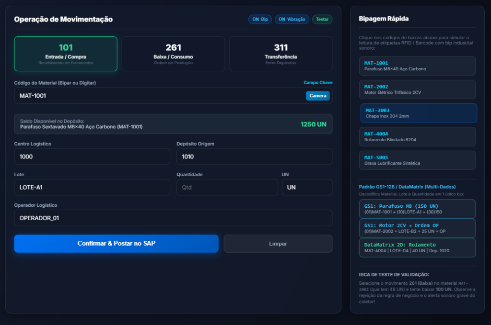
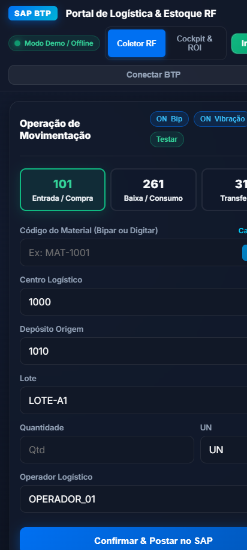
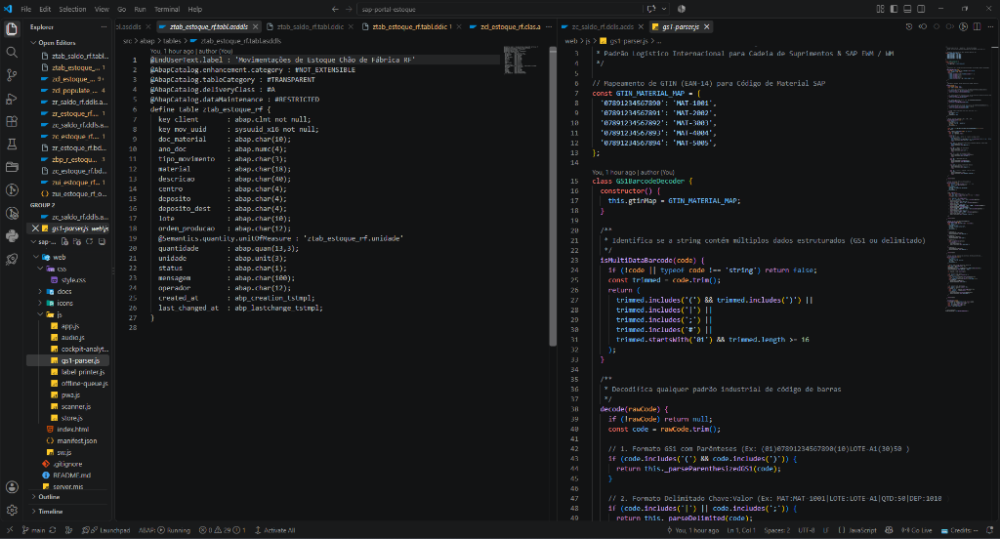
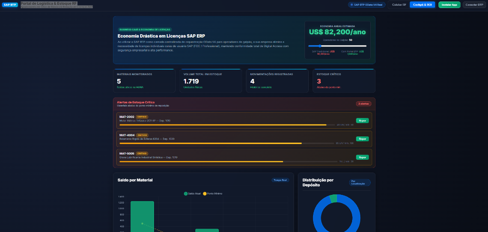
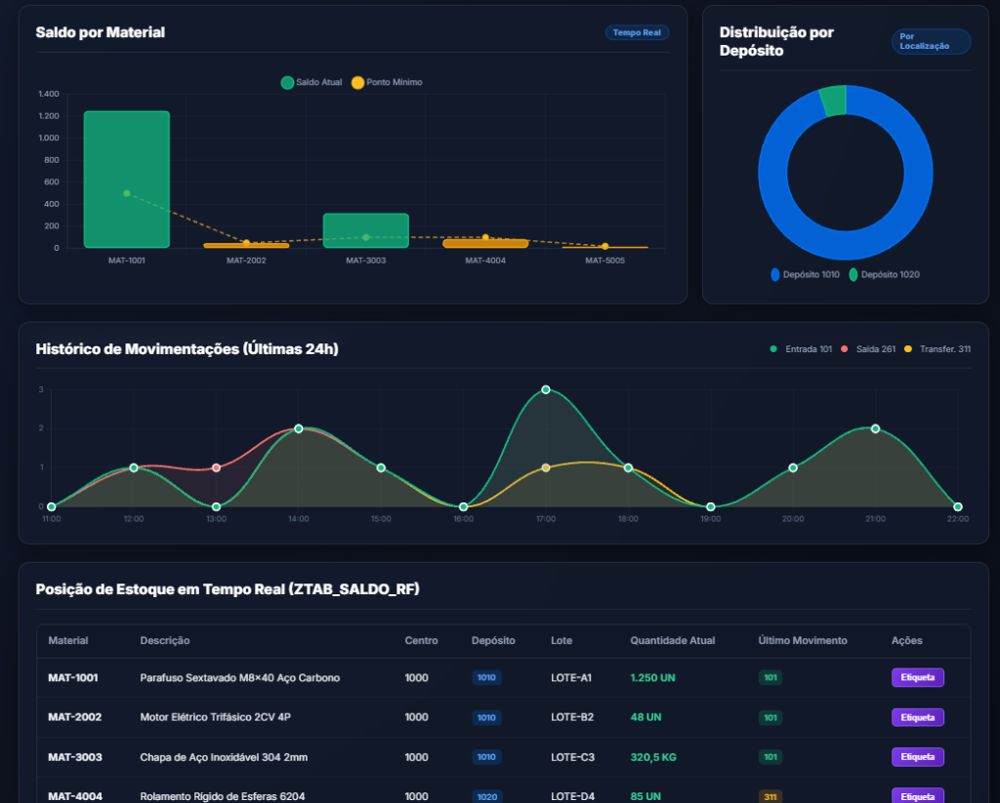
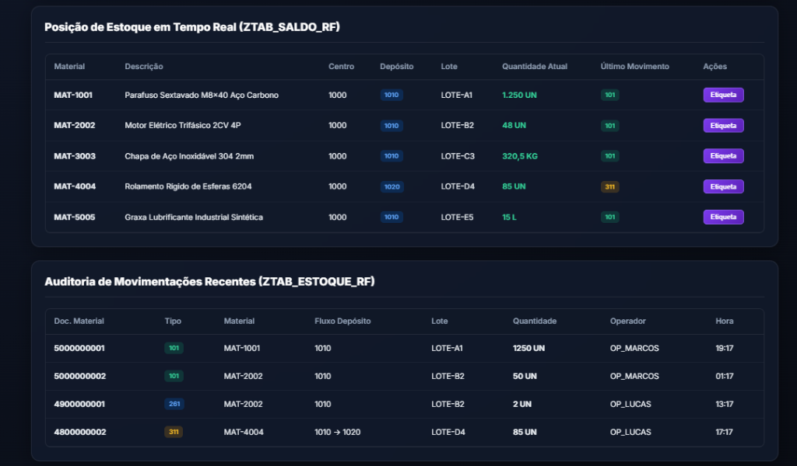
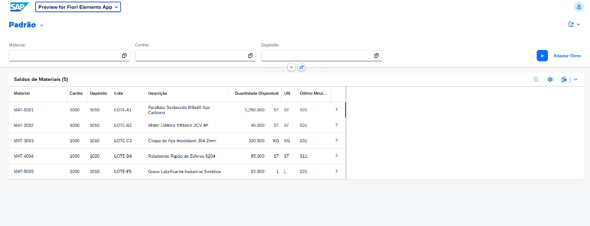
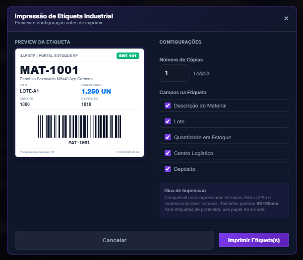
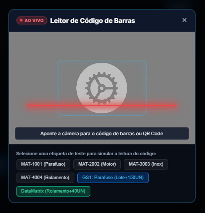

# SAP BTP — Portal de Logística & Apontamento de Estoque RF

<div align="center">


[](https://rhaonyferraz.github.io/sap-portal-estoque/)

**Solução de chão de fábrica que otimiza custos de licenças de usuário SAP.**  
Operadores realizam apontamentos via tablet, coletor de dados RF ou smartphone, integrados ao SAP BTP ABAP Cloud via OData V4 em tempo real.

**Acesse a demonstração interativa:** [https://rhaonyferraz.github.io/sap-portal-estoque/](https://rhaonyferraz.github.io/sap-portal-estoque/)

</div>

---

## Screenshots do Sistema

### Coletor RF — Operação de Movimentação e Apontamento


> Terminal de chão de fábrica com seleção de movimentação (101 Entrada, 261 Baixa de Produção, 311 Transferência), leitor de código de barras USB/Bluetooth, validação em tempo real e painel auxiliar com suporte aos padrões GS1-128 e DataMatrix.

---

### Versão Mobile em Smartphone / Coletor RF Portátil
<div align="center">
  
</div>

> Interface responsiva operando diretamente no celular ou coletor portátil (PWA instalável). Layout otimizado para operação com uma mão, teclas ampliadas e feedback tátil por vibração a cada bipagem.

---

### Desenvolvimento no VS Code — ABAP Cloud (CDS/DDIC) & JavaScript


> Ambiente de desenvolvimento integrado no VS Code. Na coluna esquerda, definição da tabela `ZTAB_ESTOQUE_RF` em Core Data Services (CDS DDLS) com tipagens e anotações para o SAP HANA. Na coluna direita, decodificador GS1-128/DataMatrix com mapeamento de identificadores de aplicação. Na barra lateral, organização modular dos artefatos ABAP e Web.

---

### Cockpit & ROI — Calculadora de Economia de Licenças e KPIs


> Painel analítico executivo demonstrando o Business Case de redução de custos com licenças SAP ERP (US$ 82.200/ano de economia para 50 operadores), indicadores em tempo real e monitoramento automatizado de estoque crítico.

---

### Gráficos Analíticos e Histórico de Movimentações


> Visualização analítica desenvolvida com Chart.js: saldo por material vs. ponto de reposição, distribuição percentual por depósito e curva horária de movimentações registradas nas últimas 24 horas.

---

### Posição de Estoque em Tempo Real e Auditoria


> Visão granular dos saldos persistidos na tabela `ZTAB_SALDO_RF` (SAP HANA) com emissão de etiquetas e trilha completa de auditoria de movimentações na `ZTAB_ESTOQUE_RF` com número de documento, tipo, lote e operador.

---

### SAP Fiori Elements — Preview da Aplicação no SAP BTP


> Aplicação SAP Fiori Elements gerada diretamente no SAP BTP ABAP Environment a partir do Service Binding OData V4, validando os dados persistidos na tabela `ZTAB_SALDO_RF` no SAP HANA.

---

### Impressão de Etiquetas Industriais (Code128)


> Modal de configuração e pré-visualização de etiqueta industrial com renderização vetorial SVG de código de barras Code128, personalização de campos, número de cópias e compatibilidade com impressoras térmicas Zebra ZPL.

---

### Leitor de Código de Barras via Câmera Integrada


> Módulo de leitura óptica por câmera com linha guia de mira e decodificação contínua para coletores sem scanner laser embutido e smartphones convencionais.

---

## Contexto e Proposta de Valor

Empresas que utilizam SAP ERP (ECC ou S/4HANA) frequentemente encontram barreiras de custo para licenciar todos os operadores de galpão, almoxarifes e conferentes de produção.

| Modelo | Custo Anual Estimado (50 operadores) |
|---|---|
| Licenças Individuais SAP Tradicionais | ~US$ 90.000/ano |
| Portal SAP BTP Centralizado (esta arquitetura) | ~US$ 7.800/ano |
| **Redução Estimada** | **~US$ 82.200/ano** |

> O SAP BTP viabiliza a execução de aplicações leves de borda conectadas via OData V4 sob runtime centralizado, reduzindo expressivamente o custo por terminal sem violar as diretrizes de Digital Access.

---

## Funcionalidades Principais

| Módulo | Descrição Técnica |
|---|---|
| **Coletor RF** | Suporte a leitores USB/Bluetooth Zebra e Honeywell, sinalizador piezoelétrico (Web Audio API) e flash visual |
| **Cockpit & ROI** | Gráficos Chart.js, indicadores de estoque mínimo e simulação de custos |
| **Integração BTP** | Chamadas OData V4, autenticação Basic / OAuth e handshake de token CSRF |
| **Fila Offline** | Armazenamento local resiliente, sincronização automática ao restabelecer rede e heartbeat periódico |
| **PWA** | Service Worker, manifesto de aplicativo e instalação nativa em terminais Android e Windows |
| **Feedback Háptico** | Vibração física via Vibration API em conjunto com alerta auditivo industrial |
| **Parser GS1-128** | Decodificação automática de múltiplos identificadores de aplicação (AI 01, 10, 37, etc.) em uma única leitura |
| **Etiquetagem** | Renderização vetorial SVG de código de barras Code128 |

---

## Arquitetura da Solução

```
Operador / Coletor Zebra / Celular
        │
        ▼
 ┌─────────────────────────────┐
 │   Portal Web (PWA)          │
 │   HTML + Vanilla JS         │
 │   Service Worker v1.0.3     │
 │   Fila Offline automática   │
 └────────────┬────────────────┘
              │ HTTP via Proxy Local
              ▼
 ┌─────────────────────────────┐
 │   server.mjs (Node.js)      │
 │   Proxy + CSRF + CORS fix   │
 └────────────┬────────────────┘
              │ HTTPS Basic Auth
              ▼
 ┌─────────────────────────────┐
 │   SAP BTP ABAP Environment  │
 │   OData V4 Service          │
 │   ZUI_ESTOQUE_RF_O4_V4      │
 └────────────┬────────────────┘
              │
 ┌────────────▼────────────────┐
 │   RAP Business Object       │
 │   CDS View Entities         │
 │   SAP HANA (ZTAB_*)         │
 └─────────────────────────────┘
```

---

## Movimentações Suportadas

| Código | Nome SAP | Fluxo | Validação |
|:---:|---|---|---|
| **101** | Entrada / Recebimento | Fornecedor -> Depósito | Cria saldo automaticamente |
| **261** | Baixa / Consumo | Depósito -> Ordem de Produção | Valida saldo disponível |
| **311** | Transferência entre Depósitos | Dep. Origem -> Dep. Destino | Valida saldo origem |

---

## Estrutura do Projeto

```
sap-portal-estoque/
├── server.mjs                          # Proxy Node.js (CSRF + Auth + CORS)
├── web/
│   ├── index.html                      # Portal principal
│   ├── manifest.json                   # PWA Manifest
│   ├── sw.js                           # Service Worker v1.0.3
│   ├── css/style.css                   # Design System Fiori Dark
│   ├── icons/                          # Ícones PWA (SVG, 192px, 512px)
│   ├── docs/screenshots/               # Screenshots do sistema
│   └── js/
│       ├── app.js                      # Controller principal
│       ├── store.js                    # OData V4 + LocalStorage
│       ├── offline-queue.js            # Fila Offline + Auto-Sync
│       ├── audio.js                    # Bip industrial + Háptico
│       ├── scanner.js                  # Leitor USB/BT + Câmera
│       ├── gs1-parser.js               # Parser GS1-128/DataMatrix
│       ├── cockpit-analytics.js        # Chart.js + Alertas
│       ├── label-printer.js            # Impressão de Etiquetas
│       └── pwa.js                      # Install prompt PWA
└── src/abap/
    ├── tables/                         # ZTAB_ESTOQUE_RF, ZTAB_SALDO_RF
    ├── classes/                        # ZCL_ESTOQUE_RF (lógica de negócio)
    ├── cds/                            # ZR_* (Root) + ZC_* (Projection + UI Annotations)
    ├── rap/                            # BDEF + Behavior Pool (validação + determinação)
    └── service/                        # ZUI_ESTOQUE_RF_O4 (Service Definition)
```

---

## Como Executar

### Modo Demonstração (sem SAP — 100% offline)
```bash
# Clone o repositório
git clone https://github.com/RhaonyFerraz/sap-portal-estoque.git
cd sap-portal-estoque

# Abra direto no browser
# Arraste web/index.html para o Chrome — funciona com dados de demonstração
```

### Modo SAP BTP Real
```bash
# Instale dependências do proxy
npm install

# Inicie o servidor proxy (porta 3000)
node server.mjs

# Acesse no browser
open http://localhost:3000

# No portal -> Botão de configuração de BTP -> informe URL + usuário + senha
```

---

## Ativação no SAP BTP (VS Code + SAP ADT)

Consulte o guia completo em [`docs/sap_adt_activation_guide.md`](docs/sap_adt_activation_guide.md).

**Ordem de criação dos objetos ABAP:**

```
1. Tabelas DDIC    -> ZTAB_SALDO_RF, ZTAB_ESTOQUE_RF
2. Classes ABAP    -> ZCL_ESTOQUE_RF, ZCL_POPULATE_ESTOQUE_RF
3. Carga de Dados  -> F9 em ZCL_POPULATE_ESTOQUE_RF
4. CDS Views       -> ZR_SALDO_RF -> ZR_ESTOQUE_RF -> ZC_SALDO_RF -> ZC_ESTOQUE_RF
5. RAP             -> BDEF + ZBP_R_ESTOQUE_RF (Behavior Pool)
6. Service         -> ZUI_ESTOQUE_RF_O4 -> Publish como OData V4
7. Conectar Portal -> "Conectar BTP" -> colar URL + credenciais
```

---

## Tecnologias Empregadas

| Camada | Tecnologia |
|---|---|
| **Backend SAP** | ABAP Cloud, RAP (Restful ABAP Programming Model), CDS View Entities, SAP HANA |
| **API** | OData V4 (SAP BTP ABAP Environment) |
| **Frontend** | HTML5, Vanilla CSS, Vanilla JavaScript (zero dependências pesadas) |
| **PWA** | Service Worker, Web App Manifest, Cache API |
| **Gráficos** | Chart.js v4.4.4 |
| **Barcodes** | JsBarcode v3.11.6, GS1-128 Parser customizado |
| **Áudio** | Web Audio API (bip piezoelétrico 2700Hz sintetizado) |
| **Offline** | localStorage + auto-sync por evento `online` |
| **Design** | Fiori Dark Horizon, Glassmorphism, Tipografia Inter |

---

## Autor

**Rhaony Ferraz**  
Desenvolvedor SAP BTP & ABAP Cloud

[](https://www.linkedin.com/in/rhaony-ferraz)
[](https://github.com/RhaonyFerraz)

> Projeto desenvolvido para demonstrar integração entre **SAP BTP ABAP Cloud** e aplicações web modernas de chão de fábrica, com foco em **redução de TCO de licenças SAP**.

---

## Licença

MIT License — Livre para uso e adaptação em projetos comerciais e educacionais.
