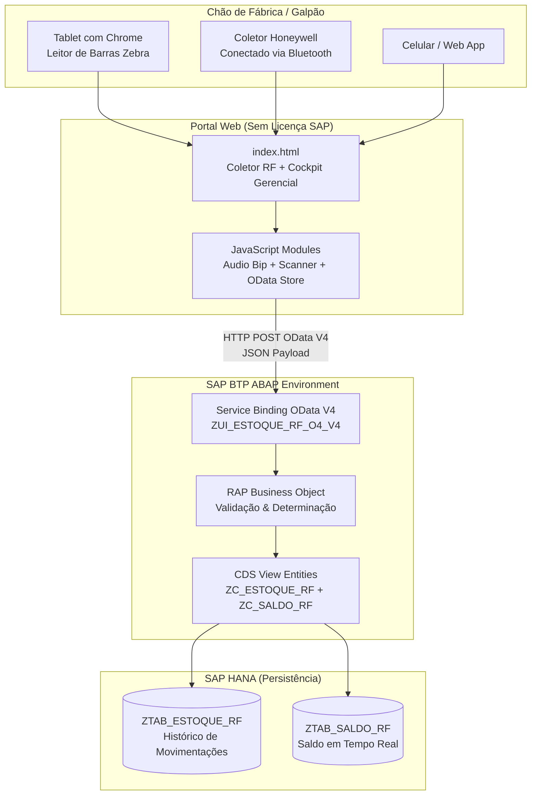

# 🏭 Portal de Logística & Apontamento de Estoque Integrado ao SAP BTP

> **Solução de chão de fábrica que elimina licenças caras de usuário SAP** — operadores registram movimentações via tablet/coletor RF, integrado diretamente ao SAP BTP ABAP Environment via OData V4.

<div align="center">


</div>

---

## 🎯 O Problema que Resolvemos

Empresas que utilizam SAP ERP (ECC ou S/4HANA) enfrentam um custo elevado para dar acesso a **operadores de galpão, almoxarifes e apontadores de chão de fábrica**: cada usuário exige uma licença individual (`Professional User` ou `FOC`) que pode custar **US$ 100–200/mês por pessoa**.

Para uma operação com 50 operadores, isso representa:

| Modelo | Custo Anual |
|---|---|
| **SAP Licenças Individuais Tradicionais** | ~US$ 90.000/ano |
| **Portal SAP BTP (essa solução)** | ~US$ 6.000/ano |
| **💰 Economia Estimada** | **~US$ 84.000/ano** |

**Como?** O SAP BTP permite hospedar uma aplicação web customizada que consome o SAP via OData V4 de forma centralizada, usando apenas **runtime de BTP** (muito mais barato que licenças por usuário), sem violar a política de Digital Access.

---

## 🏗️ Arquitetura da Solução



---

## 📦 Movimentações Suportadas

| Código | Nome | Fluxo de Estoque | Regra de Validação |
|:---:|---|---|---|
| **101** | Entrada / Recebimento | Fornecedor ➔ Depósito | Cria saldo se não existe |
| **261** | Baixa / Consumo | Depósito ➔ Ordem de Produção | ⚠️ Valida saldo disponível |
| **311** | Transferência | Dep. Origem ➔ Dep. Destino | ⚠️ Valida saldo origem |

---

## 📁 Estrutura do Projeto

```
sap-portal-estoque/
├── src/
│   └── abap/
│       ├── tables/
│       │   ├── ztab_saldo_rf.tabl.asddls        # Saldos em Tempo Real
│       │   └── ztab_estoque_rf.tabl.asddls       # Histórico de Movimentações
│       ├── classes/
│       │   ├── zcl_estoque_rf.clas.abap          # Lógica de Negócio & Validação
│       │   └── zcl_populate_estoque_rf.clas.abap # Carga Inicial de Dados (F9)
│       ├── cds/
│       │   ├── zr_saldo_rf.ddls.asddls           # Root View Entity - Saldos
│       │   ├── zr_estoque_rf.ddls.asddls         # Root View Entity - Movimentações
│       │   ├── zc_saldo_rf.ddls.asddls           # Projection View com UI Annotations
│       │   └── zc_estoque_rf.ddls.asddls         # Projection View com UI Annotations
│       ├── rap/
│       │   ├── zr_estoque_rf.bdef.asbdef         # Behavior Definition (Managed)
│       │   ├── zc_estoque_rf.bdef.asbdef         # Projection Behavior Definition
│       │   ├── zbp_r_estoque_rf.clas.abap        # Behavior Pool (Abstract Class)
│       │   └── zbp_r_estoque_rf.clas.locals_imp.abap # Handler (Validação + Determinação)
│       └── service/
│           └── zui_estoque_rf_o4.srvd.asrvds     # Service Definition OData V4
├── web/
│   ├── index.html                                # Portal Web (Coletor RF + Cockpit)
│   ├── css/
│   │   └── style.css                            # Design System Fiori Dark Horizon
│   └── js/
│       ├── audio.js                             # Bip Industrial (Web Audio API)
│       ├── scanner.js                           # Leitor de Código de Barras
│       ├── store.js                             # OData V4 Store + Modo Offline
│       └── app.js                              # Controller Principal
└── docs/
    └── sap_adt_activation_guide.md              # Guia de Ativação no VS Code / ADT
```

---

## ⚡ Funcionalidades do Portal Web

### 🎯 Coletor RF (Operador)
- **Bipagem de Código de Barras**: Compatível com leitores USB/Bluetooth Zebra e Honeywell (detecção automática por velocidade de digitação), simulação via clique na barra lateral
- **Som Industrial**: Bip de sucesso (agudo, estilo Zebra) e bip duplo grave de erro (saldo insuficiente), sintetizados via **Web Audio API** — sem arquivos externos
- **Flash Visual de Scanner**: Efeito luminoso instantâneo ao bipar qualquer código
- **Saldo em Tempo Real**: Consulta instantânea do saldo disponível ao preencher o campo de material — sem precisar submeter o formulário
- **Formulário Adaptativo**: Campos de Depósito Destino (311) e Ordem de Produção (261) aparecem/somem de acordo com o tipo de movimento selecionado

### 📊 Cockpit Gerencial
- **KPIs Dinâmicos**: Materiais monitorados, volume total em estoque, movimentações registradas
- **Posição de Estoque**: Tabela Fiori de saldos em tempo real (espelhando `ZTAB_SALDO_RF`)
- **Log de Auditoria**: Histórico completo das movimentações com operador, horário e documento gerado
- **Calculadora de ROI**: Slider interativo que calcula a economia anual em função do número de operadores do galpão

### 🔌 Integração Dupla (Modo Demo / SAP BTP Real)
- **Modo Demonstração** (padrão): Funciona offline, persiste dados no `localStorage`, ideal para apresentações e PoC
- **Modo SAP BTP**: Conecta ao endpoint OData V4 do Service Binding `ZUI_ESTOQUE_RF_O4_V4`, com autenticação Basic e fallback automático se offline
- Alternância feita pelo botão **"⚙️ Conectar BTP"** no header, sem reload de página

---

## 🚀 Como Executar Localmente (Demonstração)

```bash
# 1. Clone o repositório
git clone https://github.com/seu-usuario/sap-portal-estoque.git
cd sap-portal-estoque

# 2. Inicie um servidor web simples
python -m http.server 3000 --directory web

# 3. Acesse no navegador (Desktop ou Tablet)
# http://localhost:3000
```

> O portal funciona 100% em modo offline com dados de demonstração pré-carregados.

---

## 🛠️ Como Ativar no SAP BTP (VS Code + Extensão SAP ADT)

Consulte o guia detalhado em [`docs/sap_adt_activation_guide.md`](docs/sap_adt_activation_guide.md).

**Resumo de Ordem de Criação**:

```
1. Tabelas DDIC      → ZTAB_SALDO_RF, ZTAB_ESTOQUE_RF
2. Classes ABAP      → ZCL_ESTOQUE_RF, ZCL_POPULATE_ESTOQUE_RF
3. Carga de Dados    → F9 em ZCL_POPULATE_ESTOQUE_RF (cria 5 materiais + saldos)
4. CDS Views         → ZR_SALDO_RF, ZR_ESTOQUE_RF, ZC_SALDO_RF, ZC_ESTOQUE_RF
5. RAP BDEF + Pool   → ZR_ESTOQUE_RF (bdef), ZBP_R_ESTOQUE_RF (clas)
6. Service Definition → ZUI_ESTOQUE_RF_O4
7. Service Binding   → ZUI_ESTOQUE_RF_O4_V4 (OData V4 - UI) → Publish
8. Conectar Portal   → Botão "⚙️ Conectar BTP" → Colar URL do Service Binding
```

---

## 🧪 Cenários de Teste

| Cenário | Como Testar | Resultado Esperado |
|---|---|---|
| **101 - Entrada** | Bipar `MAT-1001`, qtd `100`, Confirmar | Saldo aumenta de 1250 para 1350 UN, doc `50XXXXXXXX` gerado, bip de sucesso |
| **261 - Saldo Insuficiente** | Bipar `MAT-2002` (48 UN), tipo 261, qtd `100` | ❌ Erro: "Saldo insuficiente!", bip duplo grave, sem gravação |
| **261 - Baixa Válida** | Bipar `MAT-2002`, tipo 261, qtd `4` | Saldo cai de 48 para 44 UN, doc `49XXXXXXXX` gerado |
| **311 - Transferência** | Bipar `MAT-4004`, tipo 311, dep. dest `1030`, qtd `10` | Saldo em 1020 cai 10, saldo em 1030 aumenta 10 |
| **Scanner Físico** | Conectar leitor USB Zebra, bipar etiqueta real | Código preenchido automaticamente via detecção de velocidade |

---

## 🏆 Tecnologias Utilizadas

| Camada | Tecnologia |
|---|---|
| **Backend SAP** | ABAP Cloud, RAP (Restful ABAP Programming Model), CDS View Entities |
| **OData** | OData V4 Service (SAP BTP ABAP Environment) |
| **Banco de Dados** | SAP HANA (Tabelas Transparentes DDIC) |
| **Fiori Preview** | SAP Fiori Elements (via Service Binding ADT) |
| **Frontend** | HTML5, Vanilla CSS, JavaScript (sem frameworks) |
| **Áudio** | Web Audio API (bip industrial sintetizado) |
| **Persistência Local** | LocalStorage (modo offline) |
| **Design** | Fiori Dark Horizon, Glassmorphism, Inter Font |

---

## 👤 Autor

Desenvolvido como projeto de portfólio para demonstrar integração entre **SAP BTP ABAP Cloud** e aplicações web modernas, com foco em **redução de TCO de licenças SAP** em ambientes de chão de fábrica.

---

## 📄 Licença

MIT License — Livre para uso e adaptação em projetos comerciais e educacionais.
